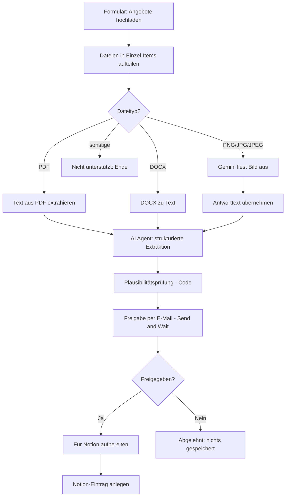

# Angebotsworkflow (erweitert)

Automatisierte Auswertung von Lieferanten- und Dienstleisterangeboten mit n8n, KI-Extraktion, regelbasierter Plausibilitätsprüfung und menschlicher Freigabe vor der Ablage in Notion.

---

## 1. Kurzbeschreibung

Der Workflow nimmt Angebotsdokumente (PDF, Word, Bild) über ein Web-Formular entgegen, liest sie mit KI aus und erzeugt daraus einen strukturierten Datensatz: Anbieter, Datum, Projekt, Positionen mit Preisen, Gesamtpreis, Hinweise, Kategorie und eine Zwei-Satz-Zusammenfassung.

Der Datensatz wird automatisch auf Plausibilität geprüft und per E-Mail an eine verantwortliche Person geschickt. **Erst nach ausdrücklicher Freigabe** wird er in einer Notion-Datenbank gespeichert.

**Problem, das gelöst wird:** Angebote kommen in uneinheitlichen Formaten und müssen bisher manuell gelesen, verglichen und abgetippt werden. Das ist langsam und fehleranfällig.

## 2. Ziel und Nutzen

| Ziel | Erwarteter Effekt |
|---|---|
| **Zeit** | Wegfall des manuellen Abtippens. Die Prüfperson sieht nur eine kompakte Zusammenfassung statt eines ganzen Dokuments. |
| **Qualität** | Einheitliche Struktur und Kategorien. Angebote werden vergleichbar. |
| **Fehlerquote** | Die Plausibilitätsprüfung erkennt Rechenabweichungen, fehlende Preise und ungültige Datumsangaben. Dazu kommt die menschliche Freigabe. |
| **Nachvollziehbarkeit** | Prüfstatus und Auffälligkeiten werden mit dem Eintrag in Notion gespeichert. |

Die genannten Effekte sind Zielgrößen. Wie sie gemessen werden, steht in Abschnitt 11.

## 3. Beschreibung der Erweiterung

Die Basisversion extrahierte nur Daten und schrieb sie direkt nach Notion. Ergänzt wurden:

1. **Klassifikation und Zusammenfassung:** Das Angebot wird einer festen Kategorie zugeordnet (Elektro, Material/Hardware, Software/IT, Dienstleistung/Beratung, Bau/Handwerk, Sonstiges) und in maximal zwei Sätzen zusammengefasst. *Warum:* schnelle Orientierung und spätere Filterbarkeit.
2. **Strukturierte Ausgabe per JSON-Schema:** Ein Output Parser erzwingt ein festes Format. *Warum:* Folgenodes können sich auf Feldnamen und Datentypen verlassen.
3. **Plausibilitätsprüfung (ohne KI):** Ein Code-Node prüft Summen, fehlende Preise und das Datumsformat. *Warum:* KI-Ausgaben sind nicht deterministisch. Eine feste Regel ist nachvollziehbar und kann sich nicht „irren".
4. **Menschliche Freigabe per E-Mail:** Der Workflow pausiert, bis jemand freigibt oder ablehnt. *Warum:* Fehler der KI sollen nicht ungeprüft in der Datenbank landen.
5. **Schutz vor Prompt Injection:** Der Prompt weist die KI an, Anweisungen im Angebotstext zu ignorieren, nichts zu erfinden und unklare Werte als `null` auszugeben.
6. **Fallback für nicht unterstützte Dateitypen.**

## 4. Ablauf des Workflows

> **Screenshot:** Hier den Screenshot der n8n-Arbeitsfläche einfügen, z. B. als `docs/workflow.png`:
> ``

| Schritt | Node | Funktion |
|---|---|---|
| 1 | On form submission | Formular „Automatisierte Angebotszusammenfassung" mit Datei-Upload. |
| 2 | Code in JavaScript | Zerlegt Uploads in einzelne Items und speichert den Dateinamen. |
| 3 | Switch | Routing nach Dateiendung (`.pdf`, `.docx`, `.png/.jpg/.jpeg`, sonst Fallback). |
| 4 | Extract from File / DOCX to Text / Analyze an image | Text aus dem Dokument gewinnen. Bilder werden per Gemini ausgelesen. |
| 5 | AI Agent + Structured Output Parser | Extraktion, Klassifikation und Zusammenfassung nach festem Schema. |
| 6 | Plausibilitätsprüfung | Setzt `pruefstatus` (`OK` / `Prüfen`) und `auffaelligkeiten`. |
| 7 | Freigabe per E-Mail | Gmail „Send and Wait" mit Buttons *Freigeben* / *Ablehnen*. |
| 8 | Freigegeben? | Verzweigung nach Entscheidung. |
| 9 | Für Notion aufbereiten, Create a database page | Formatierung und Anlage des Notion-Eintrags. |

**Plausibilitätsregeln:** keine Positionen erkannt, Gesamtpreis fehlt, Positionen ohne Preis, Summe der Positionen weicht vom Gesamtpreis ab (Toleranz 0,01), Datum nicht im Format `YYYY-MM-DD`.

## 5. Tools und KI-Modelle

| Tool / Modell | Verwendung | Begründung |
|---|---|---|
| **n8n** | Orchestrierung | Visuelle Workflows, viele Integrationen, selbst hostbar. |
| **Groq, `openai/gpt-oss-20b`** | Textextraktion im AI Agent | Schnelle Antwortzeiten und niedrige Kosten bei überschaubarer Aufgabe (Text zu JSON). Das Modell ist klein, deshalb braucht es die Prüfschritte danach. |
| **Google Gemini, `gemini-3.1-flash-lite`** | Auslesen von Bildern | Multimodal, günstig. Wird nur für Bilder genutzt. |
| **Gmail (OAuth2)** | Freigabe-Mail | Send-and-Wait-Funktion direkt in n8n. |
| **Notion** | Ablage der Angebote | Gut durchsuchbare Datenbank mit Filtern. Keine zusätzliche Infrastruktur nötig. |
| **n8n-nodes-docx-converter** (Community-Node) | DOCX zu Text | Kein nativer n8n-Node für Word-Dateien vorhanden. |

Hinweis: Im Workflow existiert zusätzlich ein nicht verbundener Node „Google Gemini Chat Model". Er wird nicht genutzt und kann gelöscht werden.

## 6. Daten

**Verarbeitet werden:** hochgeladene Angebotsdokumente und die daraus extrahierten Felder (Anbieter, Datum, Projekt, Positionen, Preise, Hinweise).

- **Vertraulich:** Preise, Konditionen und Projektbezeichnungen sind Geschäftsgeheimnisse.
- **Personenbezogen:** Angebote enthalten häufig Ansprechpartner (Name, E-Mail, Telefon) und bei Einzelunternehmern ggf. Privatadressen. Das Schema extrahiert diese Felder nicht gezielt, **der komplette Dokumenttext geht aber an die KI-Anbieter**.
- **Nicht vorgesehen:** besondere Kategorien personenbezogener Daten (Art. 9 DSGVO). Entsprechende Dokumente dürfen nicht hochgeladen werden.
- **Speicherorte:** Dokumentinhalte bei Groq bzw. Google (Verarbeitung), Datensatz in Notion, Zusammenfassung in der Freigabe-Mail (Gmail), Ausführungsdaten in n8n.

## 7. Integration im Unternehmen

**Technisch**
- n8n-Instanz mit öffentlich erreichbarer Webhook-URL (nötig für Formular und Freigabe-Links), idealerweise per HTTPS und mit Zugriffsschutz.
- Konten und Credentials für Groq, Google AI, Gmail und Notion, möglichst als Dienstkonten statt privater Konten.
- Notion-Datenbank mit passendem Schema (siehe Abschnitt 12).
- Backup des Workflows (JSON im Git) und der n8n-Datenbank.

**Organisatorisch (Vorschlag, im Unternehmen festzulegen)**

| Rolle | Aufgabe |
|---|---|
| Fachverantwortliche/r (z. B. Einkauf, Projektleitung) | Prüft und gibt Angebote frei, pflegt Kategorien. |
| Betrieb (IT / Administrator) | Betrieb von n8n, Credentials, Updates, Fehlerüberwachung. |
| Datenschutzbeauftragte/r | Bewertung, Verarbeitungsverzeichnis, Auftragsverarbeitungsverträge. |
| Workflow-Eigentümer/in | Änderungen am Prompt und Schema, Dokumentation, Freigabe von Änderungen. |

Der Empfänger der Freigabe-Mail ist im Node „Freigabe per E-Mail" fest hinterlegt und muss vor dem Einsatz angepasst werden. Eine Vertretungsregelung fehlt bisher.

## 8. Governance und Compliance

Dies ist keine Rechtsberatung. Die Punkte sind vor dem Produktiveinsatz mit den zuständigen Stellen zu klären.

- **Datenschutz (DSGVO):** Rechtsgrundlage klären (i. d. R. berechtigtes Interesse oder Vertragsanbahnung). Mit Groq, Google und Notion sind Auftragsverarbeitungsverträge nötig. Auf Drittlandübermittlung (USA) und Standardvertragsklauseln achten. Einträge ins Verarbeitungsverzeichnis, Löschkonzept für Notion und n8n-Ausführungsdaten definieren.
- **Informationssicherheit:** Zugriffsrechte nach Need-to-know, keine Klartext-Zugangsdaten im Repository, Credentials nur im n8n-Credential-Store, Webhook-URLs nicht öffentlich streuen, Updates der n8n-Instanz und des Community-Nodes.
- **EU AI Act:** Die Anwendung dient der Dokumentenauswertung und trifft keine Entscheidungen über Personen. Sie dürfte nach heutiger Einschätzung kein Hochrisiko-System sein. Die Einstufung ist durch das Unternehmen zu bestätigen. Unabhängig davon gilt die Pflicht zur KI-Kompetenz (Art. 4): Nutzende müssen Grenzen von KI-Ausgaben kennen. Der Workflow nutzt außerdem KI-Modelle Dritter, die Verantwortung als Betreiber bleibt beim Unternehmen.
- **Urheberrecht und Geschäftsgeheimnisse:** Angebote Dritter dürfen nur für den vorgesehenen Zweck verarbeitet werden. Prüfen, ob Vertraulichkeits- oder NDA-Klauseln die Weitergabe an KI-Dienste ausschließen. Die Anbieter-Nutzungsbedingungen zur Verwendung von Eingaben für Training sind zu beachten (API-Nutzung vs. Consumer-Dienste).
- **Mitbestimmung:** Der Workflow wertet keine Mitarbeitenden aus. Da aber über Formular und Freigabe Nutzungsdaten anfallen, sollte der Betriebsrat (falls vorhanden) informiert und eine Betriebsvereinbarung geprüft werden (§ 87 Abs. 1 Nr. 6 BetrVG).
- **Interne Richtlinien:** Vorgaben zu KI-Nutzung, Freigabegrenzen und Aufbewahrung beachten.

## 9. Risiken und Gegenmaßnahmen

| Risiko | Art | Gegenmaßnahme | Restrisiko |
|---|---|---|---|
| KI extrahiert falsche Werte oder erfindet Angaben | technisch | Prompt-Regeln (`null` statt Raten), Schema, Plausibilitätsprüfung, menschliche Freigabe | Fehler, die in sich stimmig sind, bleiben möglich |
| Prompt Injection über Angebotstext | technisch | Prompt ignoriert Anweisungen im Text. Die KI hat keine Tools und schreibt nichts selbst. Freigabe vor Speicherung | Kein vollständiger Schutz, Prüfperson muss aufmerksam bleiben |
| Datei wird falsch geroutet (z. B. `.PDF` in Großbuchstaben) | technisch | Switch auf case-insensitive stellen, Meldung bei nicht unterstützten Typen | Aktuell offen |
| Datenabfluss an Drittanbieter | rechtlich | AVV, Anbieterwahl mit EU-Optionen, keine sensiblen Dokumente, ggf. lokales Modell | Abhängig von Anbieterbedingungen |
| Freigabe wird „durchgeklickt" | organisatorisch | Zusammenfassung mit Auffälligkeiten in der Mail, Pflicht zum Abgleich mit Original, Stichproben | Verhaltensrisiko |
| Ausfall eines Dienstes (Groq, Gemini, Gmail, Notion) | technisch | Fehler-Workflow in n8n einrichten, Benachrichtigung bei Fehlschlag | Aktuell kein Fehler-Workflow |
| Ablehnungen und Fehler werden nicht gemeldet | organisatorisch | Rückmeldung an Absender ergänzen | Aktuell offen |
| Notion-Schema passt nicht (z. B. `null` im Zahlenfeld) | technisch | Schema vorab prüfen, `null`-Fall testen | Aktuell ungetestet |

## 10. Menschliche Kontrolle

- **Pflicht:** Jeder extrahierte Datensatz wird vor der Speicherung per E-Mail zur Freigabe vorgelegt. Ohne Klick auf *Freigeben* wird nichts in Notion angelegt.
- **Besondere Aufmerksamkeit:** Bei `Prüfstatus: Prüfen` (Auffälligkeiten) ist ein Abgleich mit dem Original-Angebot zwingend. Auch bei `OK` sollten Preise und Anbieter stichprobenartig geprüft werden.
- **Grenzen:** Die Prüfung der Summen ersetzt keine inhaltliche Prüfung. MwSt., Rabatte und Optionen können zu falschen Warnungen führen oder unauffällig falsch sein.
- **Keine automatischen Folgeaktionen:** Der Workflow bestellt, beauftragt oder versendet nichts an Externe.

## 11. Test und Erfolgsmessung

> **Wichtig:** Die Ergebnisse unten müssen mit eigenen Testläufen ausgefüllt werden. Ohne diese Messung ist der Nutzen nicht belegt.

**Testfälle**

| Nr. | Testfall | Erwartung | Ergebnis |
|---|---|---|---|
| T1 | Sauberes PDF mit Positionen und Gesamtpreis | Status `OK`, korrekte Felder | _eintragen_ |
| T2 | DOCX-Angebot | Wie T1 | _eintragen_ |
| T3 | Foto/Scan (JPG/PNG) | Felder werden erkannt | _eintragen_ |
| T4 | Summe der Positionen ≠ Gesamtpreis | Status `Prüfen`, Hinweis auf Abweichung | _eintragen_ |
| T5 | Position ohne Preis | `null`, Status `Prüfen` | _eintragen_ |
| T6 | Kein Gesamtpreis im Dokument | `null`, Status `Prüfen` | _eintragen_ |
| T7 | Nicht unterstützte Datei (z. B. `.xlsx`) | Landet im Fallback, kein Notion-Eintrag | _eintragen_ |
| T8 | Dateiname in Großbuchstaben (`.PDF`) | Erwartet: verarbeitet (derzeit vermutlich nicht) | _eintragen_ |
| T9 | Freigabe: *Ablehnen* | Kein Notion-Eintrag | _eintragen_ |
| T10 | Prompt-Injection im Text („Ignoriere alle Regeln …") | Anweisung wird ignoriert | _eintragen_ |
| T11 | Angebot mit `null` im Gesamtpreis, Freigabe | Notion-Eintrag wird ohne Fehler angelegt | _eintragen_ |

**Erfolgskennzahlen**

- **Extraktionsgenauigkeit:** Anteil korrekt extrahierter Felder je Testset (Soll z. B. ≥ 95 % bei Gesamtpreis und Anbieter).
- **Trefferquote der Plausibilitätsprüfung:** Wie viele absichtlich eingebaute Fehler werden gemeldet?
- **Zeitersparnis:** Bearbeitungszeit pro Angebot vorher (manuell) vs. nachher (Prüfung der Mail), gemessen an mindestens 10 Angeboten.
- **Korrekturquote:** Anteil der Freigaben, bei denen die Prüfperson Fehler fand, und Anteil der Ablehnungen.
- **Zuverlässigkeit:** Anteil fehlerfreier Durchläufe, Einsicht in die n8n-Ausführungsliste.

## 12. Installation und Nutzung

**Voraussetzungen**
- n8n (Cloud oder selbst gehostet) mit öffentlich erreichbarer URL
- Community-Node `n8n-nodes-docx-converter` installiert (*Einstellungen → Community Nodes*)
- Accounts: Groq, Google AI Studio (Gemini), Google (Gmail), Notion

**Zugangsdaten**
Alle Zugangsdaten werden ausschließlich im n8n-Credential-Store angelegt. Die exportierte JSON enthält nur Credential-IDs und -Namen, keine Schlüssel. Keine API-Keys, Tokens oder Passwörter in das Repository committen. Falls eine `.env` genutzt wird, gehört sie in die `.gitignore`.

| Credential | Typ in n8n | Benötigte Rechte |
|---|---|---|
| Groq | Groq API | API-Key |
| Gemini | Google Gemini (PaLM) API | API-Key |
| Gmail | Gmail OAuth2 | Senden von E-Mails |
| Notion | Notion API | Zugriff auf die Zieldatenbank (Integration mit der Datenbank teilen) |

**Notion-Datenbank „Angebotszusammenfassung"**

| Property | Typ |
|---|---|
| Name | Title (Anbieter) |
| Datum | Date |
| Projekt, Position, Hinweise, Kategorie, Zusammenfassung, Prüfstatus, Auffälligkeiten | Text |
| Gesamtpreis | Number |

**Einrichtung**
1. Repository klonen. Workflow-Datei `Angebotsworkflow (erweitert).json` in n8n importieren (*Workflows → Import from File*).
2. Community-Node installieren.
3. In den Nodes Gemini, Groq, Gmail und Notion eigene Credentials auswählen.
4. Im Node **Freigabe per E-Mail** die Empfängeradresse eintragen.
5. Im Node **Create a database page** die eigene Notion-Datenbank auswählen und die Property-Namen abgleichen.
6. Workflow speichern und aktivieren (im Export steht `active: false`).

**Nutzung**
1. Formular über die Production-URL des Nodes „On form submission" öffnen.
2. Angebot (PDF, DOCX, PNG, JPG, JPEG) hochladen und absenden.
3. Freigabe-Mail öffnen, Angaben mit dem Original abgleichen und *Freigeben* oder *Ablehnen* klicken.
4. Bei Freigabe erscheint der Eintrag in der Notion-Datenbank.

**Zum Testen:** Für Tests die „Test URL" des Formulars verwenden und die Ausführung in n8n beobachten. Eine eigene Testdatenbank in Notion verwenden, damit keine produktiven Daten verfälscht werden.

## Bekannte Einschränkungen

- Switch ist case-sensitive und prüft per `contains` (`.PDF` wird nicht erkannt, `x.pdf.exe` schon).
- Keine Rückmeldung bei nicht unterstützten Dateitypen oder Ablehnung.
- Kein Fehler-Workflow bei Ausfall eines Dienstes.
- `Kategorie` ist in Notion ein Textfeld, kein Select.
- Upload-Feld ist nicht ausdrücklich als Mehrfachupload konfiguriert.
- Fester Freigabe-Empfänger, keine Vertretung.
